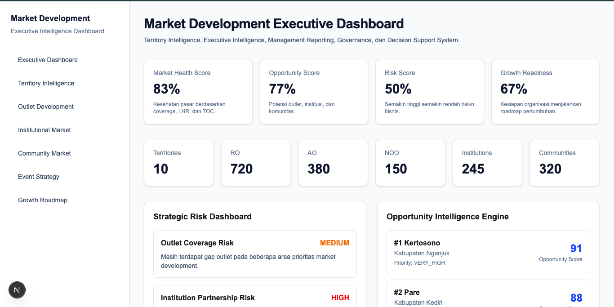
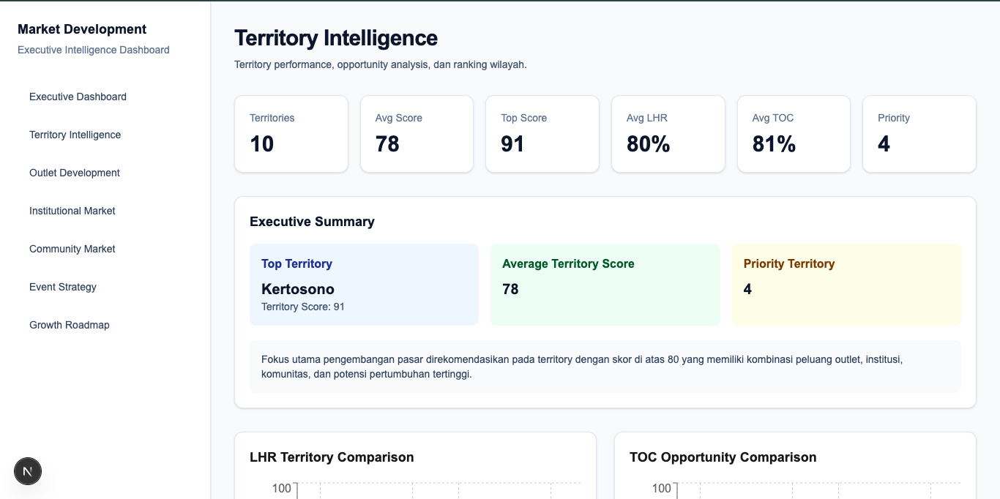
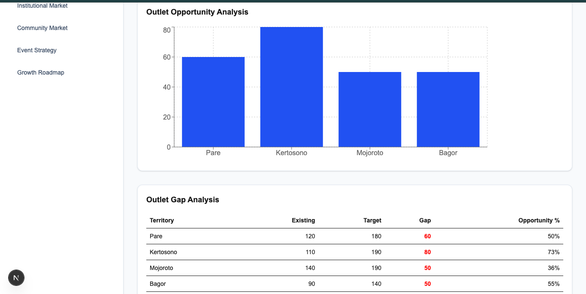
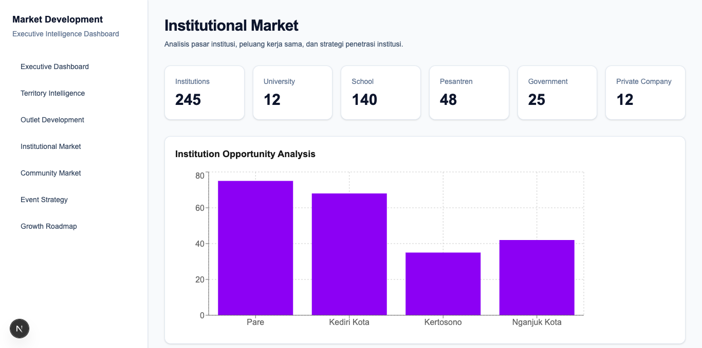
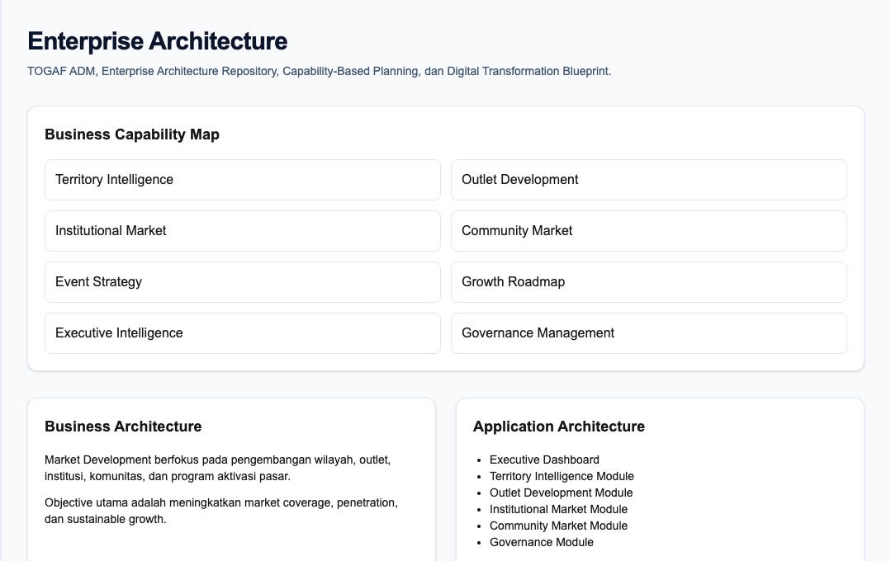
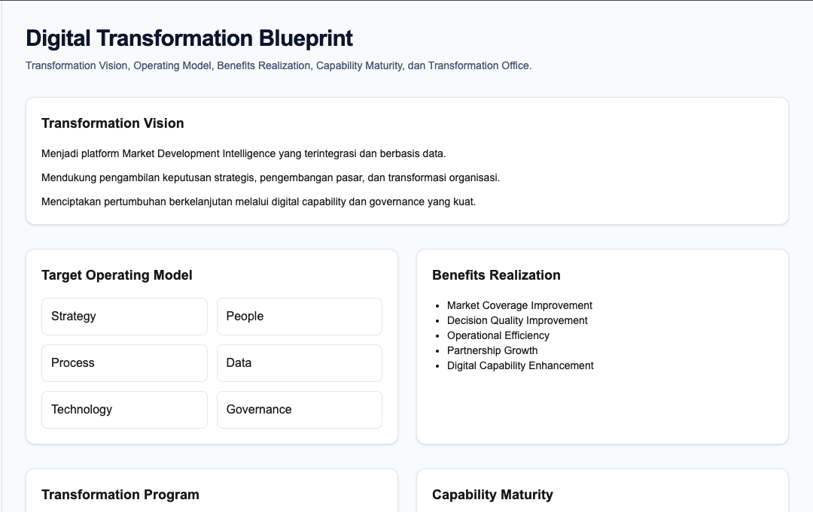
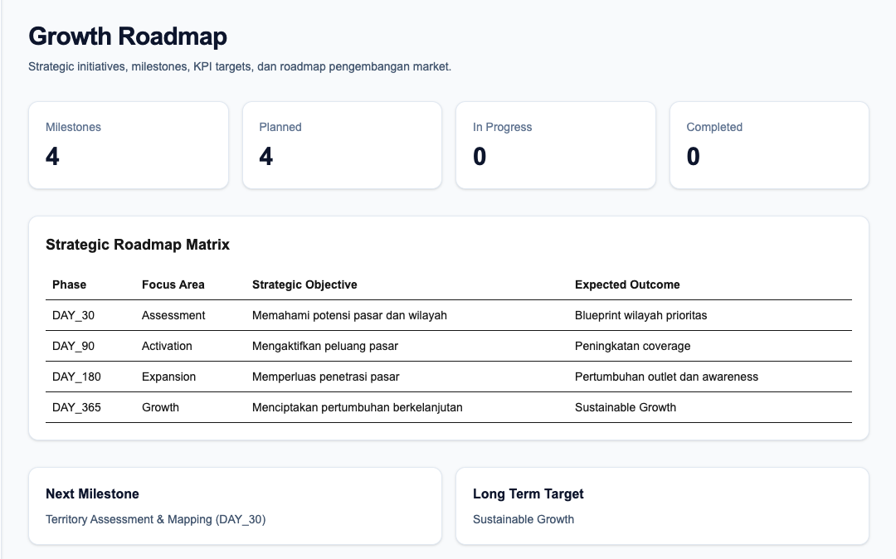

# Market Development Intelligence Platform

Enterprise Architecture • Business Analysis • Digital Transformation • Governance • Executive Intelligence

---

# Executive Summary

Market Development Intelligence Platform adalah portfolio enterprise-grade yang mendemonstrasikan kemampuan end-to-end dalam:

* Business Analysis
* Requirements Engineering
* System Analysis
* Enterprise Architecture
* Solution Architecture
* IT Governance
* Digital Transformation
* Executive Decision Support

Repository ini menggabungkan aplikasi dashboard berbasis Next.js dengan repository dokumentasi SDLC, governance, architecture, transformation, dan compliance yang selaras dengan standar internasional.

---

# Screenshots

## Executive Dashboard



---

## Territory Intelligence



---

## Outlet Development



---

## Institutional Market



---

## Enterprise Architecture



---

## Digital Transformation



---

## Growth Roadmap



---

# Portfolio Highlights

## Executive Intelligence

* Executive Scorecard
* Opportunity Dashboard
* Risk Dashboard
* Strategic Recommendation Engine
* Executive Reporting Layer

---

## Territory Intelligence

* Territory Scoring
* LHR Analysis
* TOC Analysis
* Opportunity Mapping
* Priority Classification

---

## Outlet Development

* RO Analysis
* AO Analysis
* NOO Opportunity
* Outlet Growth Dashboard

---

## Institutional Market

* Education Segment
* Government Segment
* Corporate Segment
* Institutional Opportunity Analysis

---

## Community Market

* Community Mapping
* Engagement Analysis
* Community Opportunity Dashboard

---

## Event Strategy

* Event Performance Analysis
* Conversion Analysis
* Lead Tracking Framework

---

## Growth Roadmap

* Day 30
* Day 90
* Day 180
* Day 365

Strategic growth planning dashboard.

---

# Enterprise Architecture Repository

## Business Architecture

* Capability Map
* Stakeholder Map
* Value Stream Analysis
* Business Architecture

## Application Architecture

* Solution Architecture
* Application Landscape
* Component Architecture

## Data Architecture

* Entity Catalog
* Data Dictionary
* Information Architecture

## Technology Architecture

* Technology Stack
* Repository Architecture
* Technical Architecture

## Architecture Governance

* Architecture Principles
* Architecture Governance
* ADR
* Architecture Review Checklist
* Repository Standards

---

# Digital Transformation Repository

## Transformation Vision

Future State Definition

## Target Operating Model

Operating Model Design

## Benefits Realization

Value Tracking Framework

## Capability Maturity

Capability Assessment

## Transformation Governance

Transformation Oversight

---

# Governance Repository

## Risk Management

* Risk Register
* RAID Log

## Decision Management

* Decision Log
* Architecture Decision Records

## Quality Management

* Quality Gate Checklist
* Definition of Done

## Release Management

* Release Strategy
* Testing Strategy

---

# Compliance Repository

## ISO/IEC/IEEE 12207

Software Life Cycle Process Mapping

## TOGAF ADM

Architecture Development Method Mapping

## COBIT 2019

Governance Objective Mapping

## Architecture Compliance

Architecture Assessment Framework

---

# Standards Alignment

## ISO Standards

* ISO/IEC/IEEE 12207
* ISO/IEC/IEEE 15288
* ISO/IEC/IEEE 42010
* ISO/IEC 25010
* ISO 31000
* ISO 9001

## Industry Frameworks

* TOGAF ADM
* COBIT 2019
* PMBOK
* BABOK
* ITIL 4

---

# Technology Stack

## Frontend

* Next.js
* React
* TypeScript
* Tailwind CSS

## Architecture

* TOGAF ADM
* Enterprise Architecture Repository

## Governance

* COBIT 2019
* ISO Governance Practices

---

# Repository Statistics

| Category            | Count |
| ------------------- | ----: |
| Documentation Files |   52+ |
| Application Pages   |    12 |
| Components          |   63+ |
| Data Sources        |     9 |
| Release Tags        |     5 |
| Screenshot Assets   |     7 |

---

# Release History

| Version | Description                  |
| ------- | ---------------------------- |
| v1.2    | Complete Analytics           |
| v1.3    | Executive Intelligence       |
| v1.4    | Decision Support System      |
| v1.5    | Enterprise Architecture      |
| v2.0    | Enterprise Portfolio Release |

---

# Build

Install dependencies:

```bash
npm install
```

Run development server:

```bash
npm run dev
```

Production build:

```bash
npm run build
```

---

# Repository Structure

```text
app/
components/
data/
types/

docs/
├── architecture
├── business
├── governance
├── requirements
├── transformation
└── screenshots
```

---

# Demonstrated Competencies

## Business Analysis

* Requirement Elicitation
* Stakeholder Analysis
* Business Modeling
* Business Case Development

## System Analysis

* Use Case Modeling
* Functional Analysis
* Requirement Traceability
* System Specification

## Enterprise Architecture

* TOGAF ADM
* Capability Planning
* Architecture Governance
* Target Architecture Design

## Solution Architecture

* Application Design
* Data Design
* Technology Design
* Architecture Documentation

## Governance

* Risk Management
* Quality Management
* Compliance Management
* Decision Governance

## Digital Transformation

* Transformation Planning
* Benefits Realization
* Capability Maturity Assessment
* Operating Model Design

---

# Suitable Roles

* Enterprise Architect
* Solution Architect
* Lead Business Analyst
* Senior System Analyst
* Digital Transformation Lead
* IT Governance Consultant
* PMO Lead
* Technology Consultant

---

# Portfolio Assessment

Enterprise Portfolio Grade

Governance Ready

Architecture Ready

Transformation Ready

Audit Ready

Documentation Driven

---

# Author

Dawud

Enterprise Architecture • Digital Transformation • Governance • Business Analysis

---

# License

For portfolio, learning, consulting, and professional showcase purposes.
